# Scalable-Web-Application
Scalable Web Application with ALB and Auto Scaling. The project demonstrates best practices for compute scalability, security and cost optimization.

This is a two-tier architecture made up of **web tier** and **application tier**.
The separation is to enforce security of the application. The subnets are in two availability zones for better resiliency. The EC2 instances are launched by an autoscaling group and sit behind an application load balancer for improved scalability of the application.
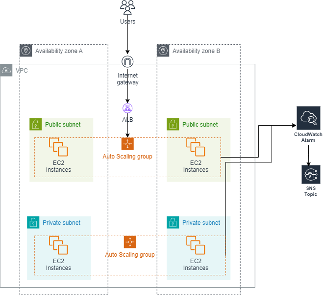

## VPC SetUp
Create the isolated virtual network (Virtual Private Cloud) for the project and the subnets: 2 private and 2 public according to the architecture above.

## IAM Roles
These are secure temporary security credentials given to aws services to access resources. In AWS, the ASG uses service-linked roles to automatically manage the EC2 instances.
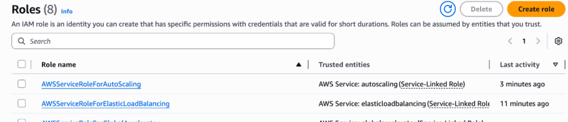

### Internet Gateway
Enables communication between the private network and public internet.
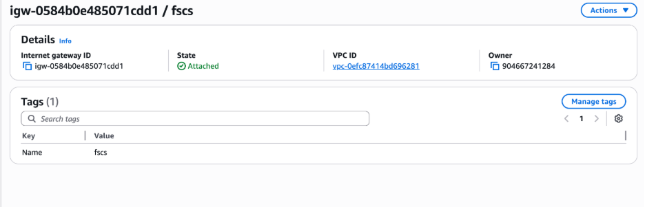

## Target Group
Target groups route requests to individual registered targets using the protocol and port number specified.
They act as a logical bridge between a load balancer’s listener and the actual compute resources.
The ALB deployed uses target groups to route http traffic based on path patterns provided.
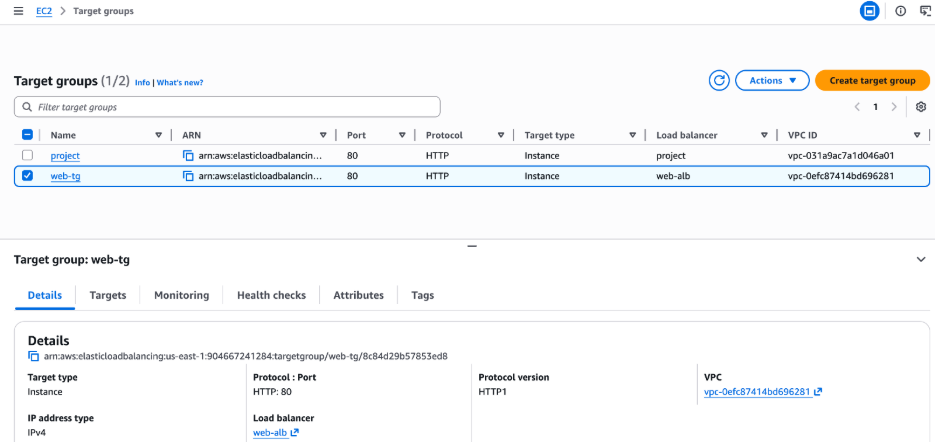

## ALB
The Application Load Balancer is ideal for layer 7 traffic. It provides load balancing for the instances spun up by the ASG. It provides distribution of traffic dependent on the settings set. Some of the techniques include round robin, least outstanding requests, and weighted target groups.
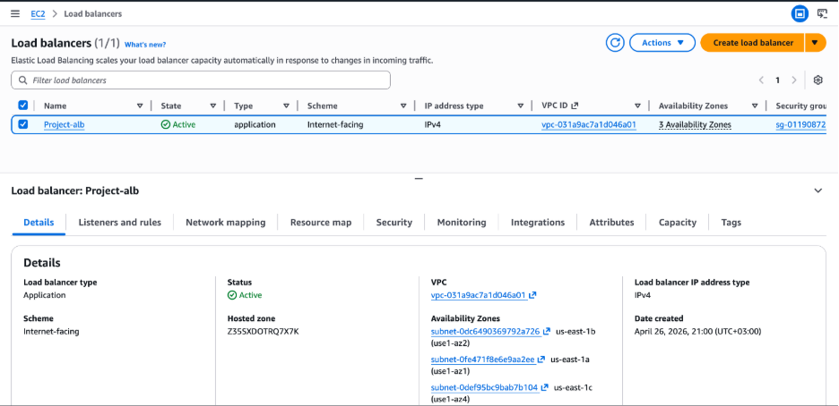

The asg is connected to a security group that allows connection using http from the internet.
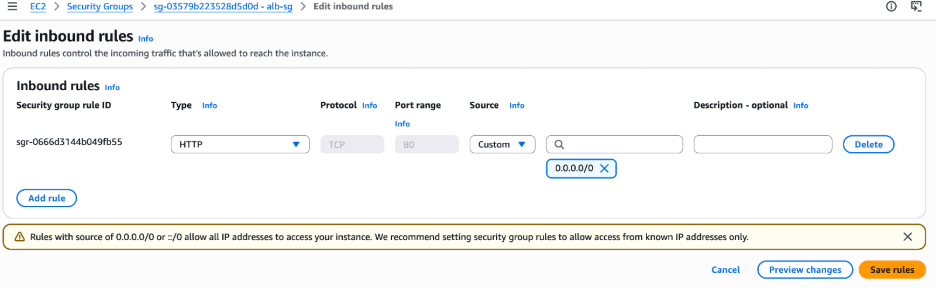

alb_dns = *"web-alb-1650564006.us-east-1.elb.amazonaws.com"*

## Launch Template
The launch template is created to act as the source for what the AutoScaling group deploys. All the settings we need e.g. instance type, AMI are specified in this template.
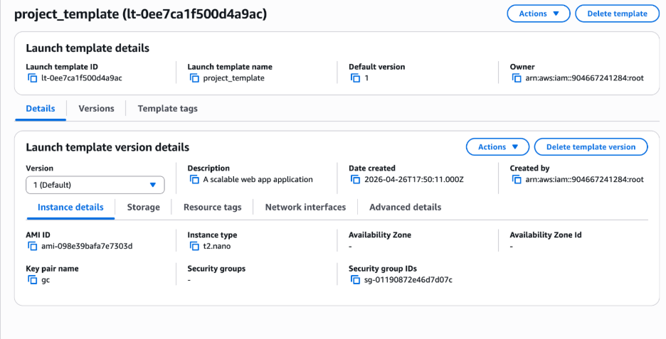

## ASG 
The launch template is attached to the AutoScaling Group. The user specifies the minimum, maximum and desired number of instances that should be deployed. in this case, I specified desired:1, min:1 and max:3.
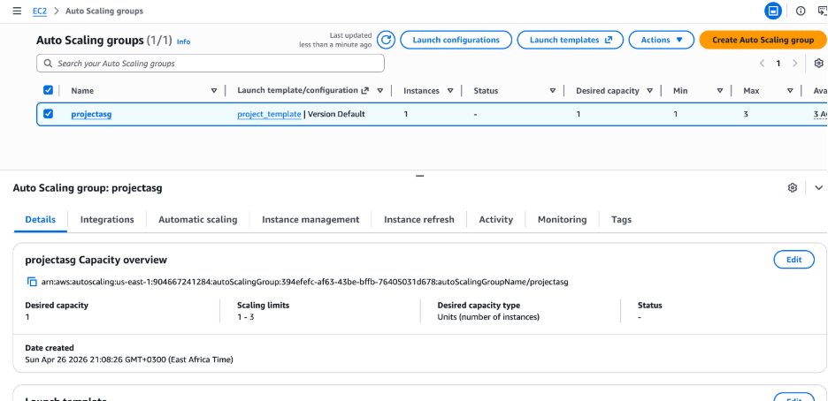

### Instances
**Public instance:**
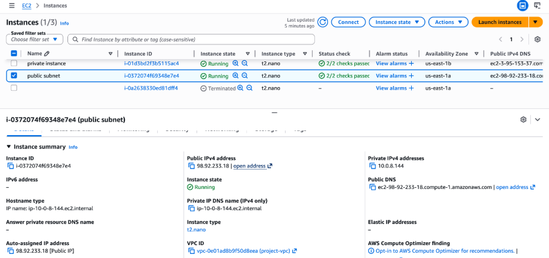

**Private instance:**
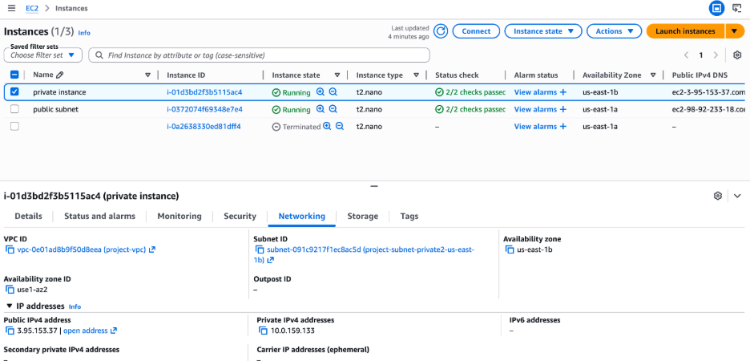

## Amazon SNS Topic
An SNS topic is used to publish messages to the specified contact e.g phone number, email address.
They are useful for sending event notification when they happen in your account, e.g. when an instance fails.
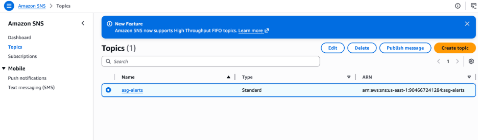

To finish setting it up, we need to confirm the email.
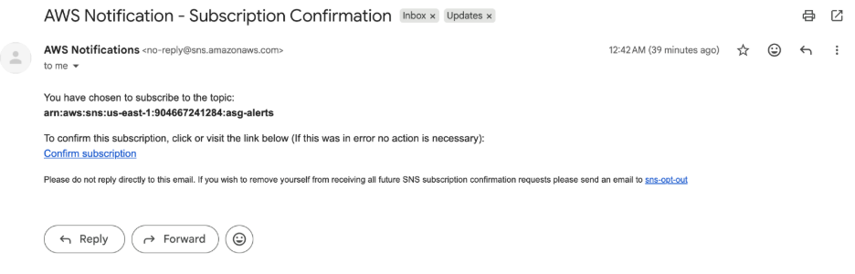

## CloudWatch
Amazon Cloudwatch is a monitoring and observability service. It provides real-time data on aws resources and applications by collecting metrics, logs and traces.
It works together with Amazon SNS to alert the relevant stakeholders when certain thresholds are reached.
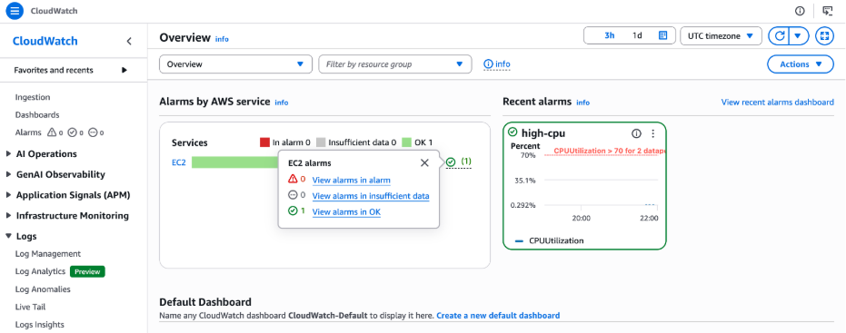